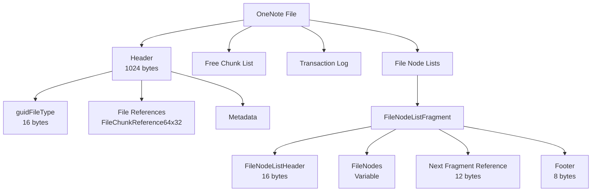
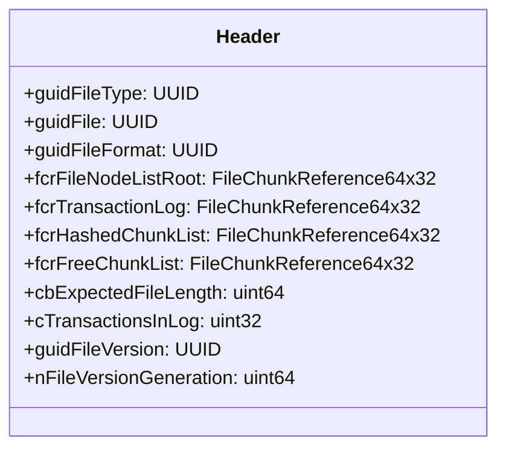
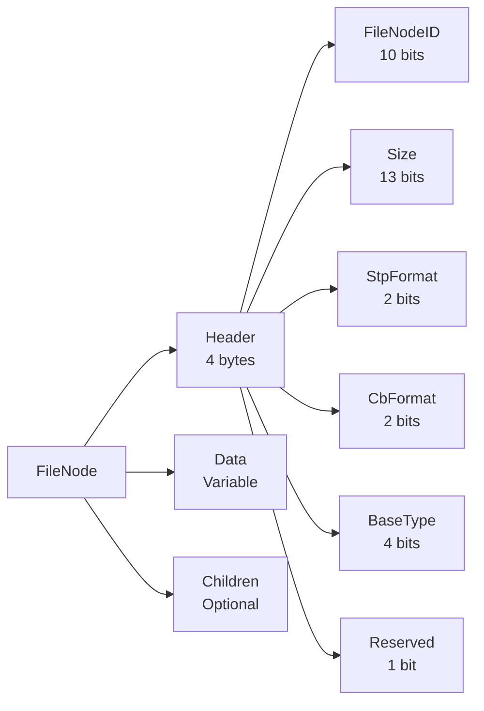
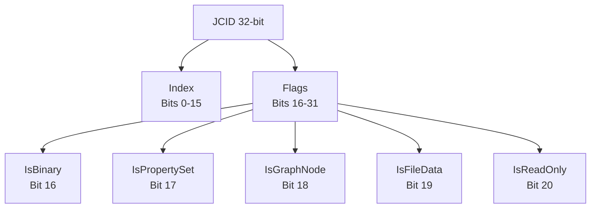
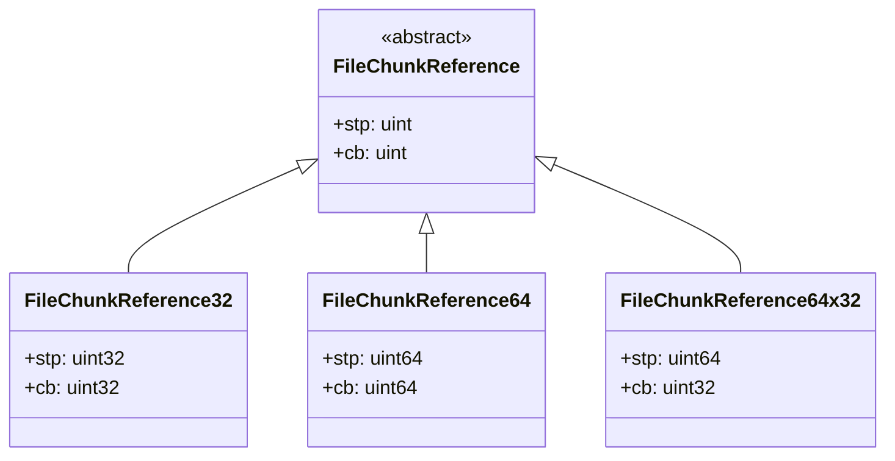
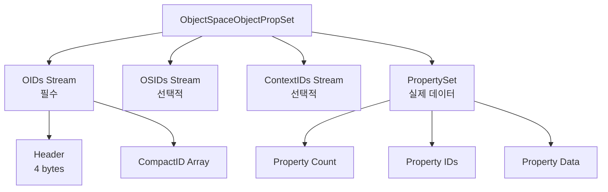
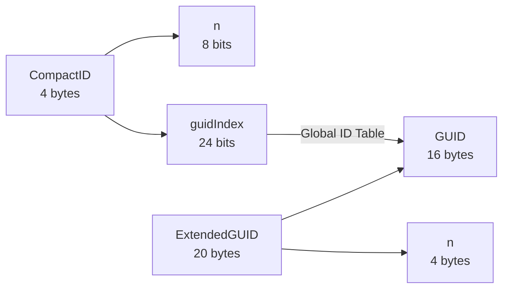
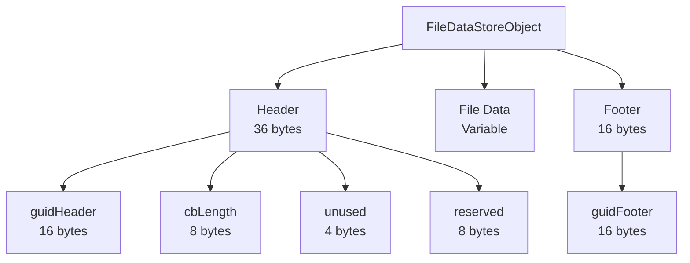
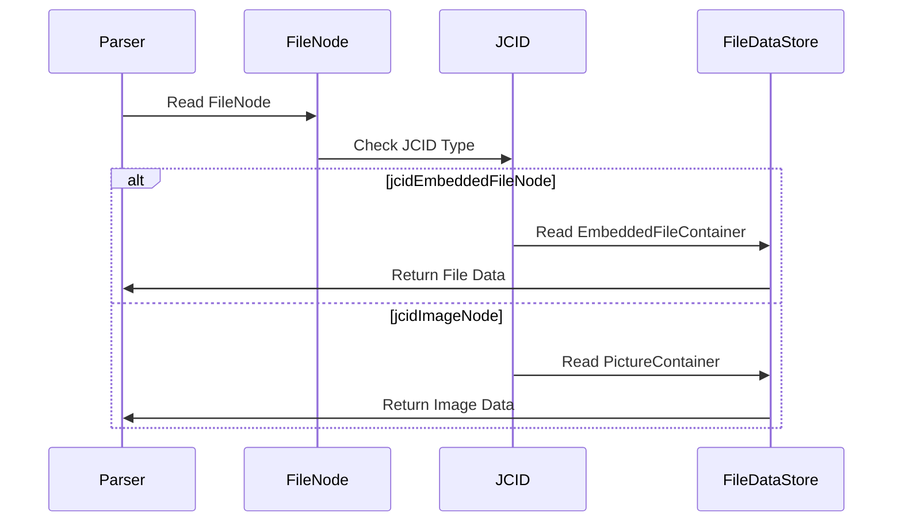

# OneNote 파일 포맷 구조 상세 설명

## 개요

OneNote 파일 포맷은 Microsoft OneNote에서 사용하는 바이너리 파일 형식으로, `.one` (개별 섹션) 및 `.onetoc2` (테이블 오브 컨텐츠) 파일 확장자를 사용합니다. 이 문서는 MS-ONE과 MS-ONESTORE 사양을 기반으로 파일 구조를 설명합니다.

## 목차

1. [파일 시그니처](#파일-시그니처)
2. [파일 구조 개요](#파일-구조-개요)
3. [헤더 구조](#헤더-구조)
4. [FileNode 시스템](#filenode-시스템)
5. [JCID 타입 시스템](#jcid-타입-시스템)
6. [데이터 참조 메커니즘](#데이터-참조-메커니즘)
7. [속성 시스템](#속성-시스템)
8. [내장 파일 처리](#내장-파일-처리)

## 파일 시그니처

OneNote 파일은 첫 16바이트로 파일 타입을 식별합니다:

| 파일 타입 | GUID | 바이트 시퀀스 (Little-Endian) |
|-----------|------|--------------------------------|
| .one | `{7B5C52E4-D88C-4DA7-AEB1-5378D02996D3}` | `E4 52 5C 7B 8C D8 A7 4D AE B1 53 78 D0 29 96 D3` |
| .onetoc2 | `{43FF2FA1-EFD9-4C76-9EE2-10EA5722765F}` | `A1 2F FF 43 D9 EF 76 4C 9E E2 10 EA 57 22 76 5F` |

## 파일 구조 개요



## 헤더 구조

OneNote 파일의 첫 1024바이트는 헤더로 구성됩니다:

### Header Fields (주요 필드)



### 헤더 필드 상세 설명

| 오프셋 | 크기 | 필드명 | 설명 |
|--------|------|--------|------|
| 0x000 | 16 | guidFileType | 파일 타입 식별자 |
| 0x010 | 16 | guidFile | 파일 고유 식별자 |
| 0x020 | 16 | guidLegacyFileVersion | 레거시 버전 (항상 0) |
| 0x030 | 16 | guidFileFormat | 파일 포맷 식별자 |
| 0x1C8 | 12 | fcrFileNodeListRoot | 루트 FileNodeList 참조 |
| 0x1D4 | 12 | fcrTransactionLog | 트랜잭션 로그 참조 |

## FileNode 시스템

### FileNode 구조

FileNode는 OneNote 파일의 기본 데이터 단위입니다:



### FileNode 헤더 비트 레이아웃

```
31                              27 26 25 24 23 22                    10 9                    0
┌───┬───────────────────────────┬──┬──┬──┬──┬───────────────────────┬─────────────────────┐
│ R │        BaseType           │CB│ST│     Size (13 bits)          │   FileNodeID        │
└───┴───────────────────────────┴──┴──┴──┴──┴───────────────────────┴─────────────────────┘
```

- **FileNodeID** (0-9): 노드 타입 식별자
- **Size** (10-22): FileNode 전체 크기
- **StpFormat** (23-24): 파일 포인터 형식
- **CbFormat** (25-26): 데이터 크기 필드 형식
- **BaseType** (27-30): 기본 타입 (0=데이터 없음, 1=데이터 참조, 2=FileNodeList 참조)
- **Reserved** (31): 예약됨

### 주요 FileNode 타입

| FileNodeID | 이름 | 설명 |
|------------|------|------|
| 0x004 | ObjectSpaceManifestRootFND | 객체 공간 매니페스트 루트 |
| 0x008 | ObjectSpaceManifestListReferenceFND | 객체 공간 리스트 참조 |
| 0x014 | RevisionManifestListStartFND | 리비전 매니페스트 시작 |
| 0x024 | GlobalIdTableEntryFNDX | Global ID 테이블 항목 |
| 0x0A4 | ObjectDeclaration2RefCountFND | 객체 선언 (참조 카운트 포함) |
| 0x0FF | ChunkTerminatorFND | 청크 종료 마커 |

## JCID 타입 시스템

JCID (JavaScript-like Compact Identifier)는 객체 타입을 식별하는 4바이트 구조입니다:

### JCID 비트 구조



### 주요 JCID 타입

| JCID 값 | 이름 | 설명 |
|---------|------|------|
| 0x00060007 | jcidSectionNode | 섹션 노드 |
| 0x0006000B | jcidPageNode | 페이지 노드 |
| 0x0006000C | jcidOutlineNode | 아웃라인 노드 |
| 0x0006000E | jcidRichTextOENode | 리치 텍스트 노드 |
| 0x00060011 | jcidImageNode | 이미지 노드 |
| 0x00060035 | jcidEmbeddedFileNode | 내장 파일 노드 |

## 데이터 참조 메커니즘

### FileChunkReference 타입

OneNote는 여러 타입의 파일 참조를 사용합니다:



### StpFormat과 CbFormat

| Format 값 | StpFormat 의미 | CbFormat 의미 |
|-----------|----------------|---------------|
| 0 | 8 바이트 (비압축) | 4 바이트 |
| 1 | 4 바이트 (비압축) | 8 바이트 |
| 2 | 2 바이트 (압축*8) | 1 바이트 (압축*8) |
| 3 | 4 바이트 (압축*8) | 2 바이트 (압축*8) |

## 속성 시스템

### ObjectSpaceObjectPropSet 구조



### CompactID와 ExtendedGUID



CompactID는 Global Identification Table을 통해 ExtendedGUID로 변환됩니다.

## 내장 파일 처리

### FileDataStoreObject 구조

내장 파일(이미지, 첨부파일 등)은 FileDataStoreObject로 저장됩니다:



### 내장 파일 처리 플로우



## 파일 파싱 순서

1. **헤더 검증**: 첫 16바이트로 파일 타입 확인
2. **헤더 파싱**: 1024바이트 헤더 읽기
3. **FileNodeList 탐색**: fcrFileNodeListRoot부터 시작
4. **FileNode 파싱**: 각 노드의 타입과 데이터 처리
5. **속성 추출**: PropertySet에서 메타데이터 추출
6. **내장 파일 추출**: FileDataStoreObject에서 파일 데이터 추출

## 코드 예제

### 파일 시그니처 확인

```python
def check_valid(file):
    """OneNote 파일 시그니처 확인"""
    signature = file.read(16)
    
    ONE_SIGNATURE = b"\xE4\x52\x5C\x7B\x8C\xD8\xA7\x4D\xAE\xB1\x53\x78\xD0\x29\x96\xD3"
    ONETOC2_SIGNATURE = b"\xA1\x2F\xFF\x43\xD9\xEF\x76\x4C\x9E\xE2\x10\xEA\x57\x22\x76\x5F"
    
    return signature in (ONE_SIGNATURE, ONETOC2_SIGNATURE)
```

### FileNode 헤더 파싱

```python
def parse_filenode_header(header_bytes):
    """FileNode 헤더 파싱"""
    header = struct.unpack('<I', header_bytes)[0]
    
    file_node_id = header & 0x3ff           # Bits 0-9
    size = (header >> 10) & 0x1fff         # Bits 10-22
    stp_format = (header >> 23) & 0x3      # Bits 23-24
    cb_format = (header >> 25) & 0x3       # Bits 25-26
    base_type = (header >> 27) & 0xf       # Bits 27-30
    
    return {
        'id': file_node_id,
        'size': size,
        'stp_format': stp_format,
        'cb_format': cb_format,
        'base_type': base_type
    }
```

## 참고 자료

- [MS-ONE] - OneNote File Format Specification
- [MS-ONESTORE] - OneNote Revision Store File Format Specification
- [MS-DTYP] - Windows Data Types
- [MS-OSHARED] - Office Common Data Types and Objects Structures

## 용어 정리

| 용어 | 설명 |
|------|------|
| **GUID** | Globally Unique Identifier, 128비트 고유 식별자 |
| **JCID** | JavaScript-like Compact Identifier, 객체 타입 식별자 |
| **FileNode** | OneNote 파일의 기본 데이터 단위 |
| **CompactID** | GUID를 압축한 4바이트 식별자 |
| **PropertySet** | 객체의 속성을 정의하는 데이터 집합 |
| **FileChunkReference** | 파일 내 데이터 위치와 크기를 지정하는 참조 |
| **Transaction Log** | 파일 수정 내역을 추적하는 로그 |

---

*이 문서는 pyOneNote 프로젝트의 일부로, MS-ONE과 MS-ONESTORE 사양을 기반으로 작성되었습니다.*
