# OneNote 파일 포맷 구조 상세 설명

## 개요

OneNote 파일 포맷은 Microsoft OneNote에서 사용하는 바이너리 파일 형식으로, `.one` (개별 섹션) 및 `.onetoc2` (테이블 오브 컨텐츠) 파일 확장자를 사용합니다. 이 문서는 MS-ONE과 MS-ONESTORE 사양을 기반으로 파일 구조를 설명합니다.

## 목차

1. [파일 시그니처](#파일-시그니처)
2. [파일 구조 개요](#파일-구조-개요)
3. [헤더 구조](#헤더-구조)
4. [FileNode 시스템](#filenode-시스템)
5. [JCID 타입 시스템](#jcid-타입-시스템)
6. [데이터 참조 메커니즘](#데이터-참조-메커니즘)
7. [속성 시스템](#속성-시스템)
8. [내장 파일 처리](#내장-파일-처리)
9. [객체 공간 계층 구조](#객체-공간-계층-구조)
10. [리비전 시스템](#리비전-시스템)
11. [트랜잭션 로그](#트랜잭션-로그)
12. [Global Identification Table](#global-identification-table)

## 파일 시그니처

OneNote 파일은 첫 16바이트로 파일 타입을 식별합니다:

| 파일 타입 | GUID | 바이트 시퀀스 (Little-Endian) |
|-----------|------|--------------------------------|
| .one | `{7B5C52E4-D88C-4DA7-AEB1-5378D02996D3}` | `E4 52 5C 7B 8C D8 A7 4D AE B1 53 78 D0 29 96 D3` |
| .onetoc2 | `{43FF2FA1-EFD9-4C76-9EE2-10EA5722765F}` | `A1 2F FF 43 D9 EF 76 4C 9E E2 10 EA 57 22 76 5F` |

## 파일 구조 개요

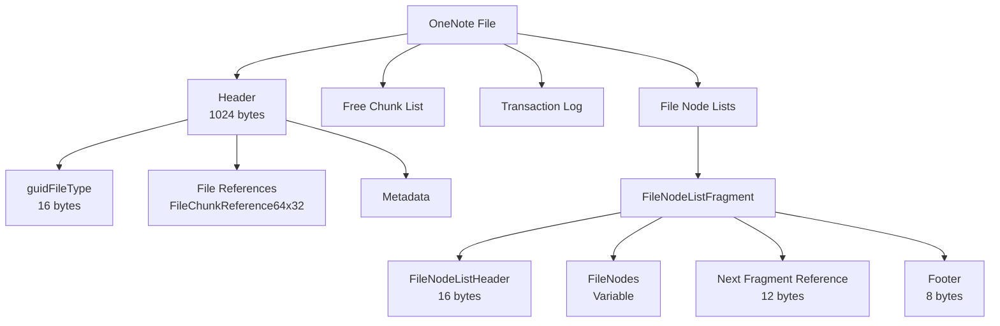
```mermaid
graph TD
    A[OneNote File] --> B[Header<br/>1024 bytes]
    A --> C[Free Chunk List]
    A --> D[Transaction Log]
    A --> E[File Node Lists]
    
    B --> B1[guidFileType<br/>16 bytes]
    B --> B2[File References<br/>FileChunkReference64x32]
    B --> B3[Metadata]
    
    E --> E1[FileNodeListFragment]
    E1 --> E2[FileNodeListHeader<br/>16 bytes]
    E1 --> E3[FileNodes<br/>Variable]
    E1 --> E4[Next Fragment Reference<br/>12 bytes]
    E1 --> E5[Footer<br/>8 bytes]
```

## 헤더 구조

OneNote 파일의 첫 1024바이트는 헤더로 구성됩니다:

### Header Fields (주요 필드)

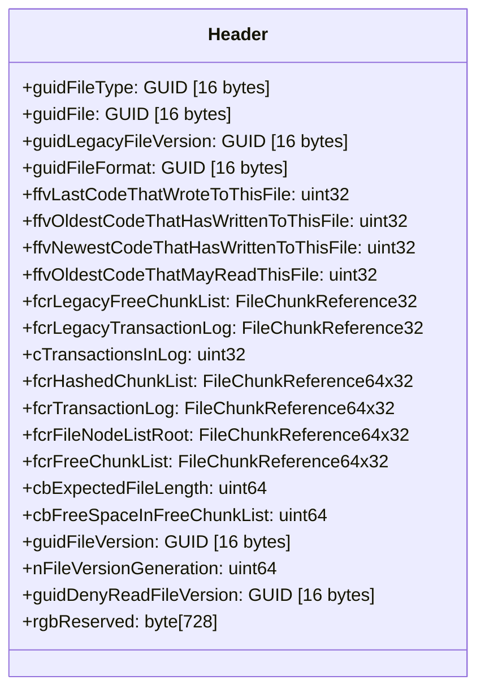
```mermaid
classDiagram
    class Header {
        +guidFileType: GUID [16 bytes]
        +guidFile: GUID [16 bytes]
        +guidLegacyFileVersion: GUID [16 bytes]
        +guidFileFormat: GUID [16 bytes]
        +ffvLastCodeThatWroteToThisFile: uint32
        +ffvOldestCodeThatHasWrittenToThisFile: uint32
        +ffvNewestCodeThatHasWrittenToThisFile: uint32
        +ffvOldestCodeThatMayReadThisFile: uint32
        +fcrLegacyFreeChunkList: FileChunkReference32
        +fcrLegacyTransactionLog: FileChunkReference32
        +cTransactionsInLog: uint32
        +fcrHashedChunkList: FileChunkReference64x32
        +fcrTransactionLog: FileChunkReference64x32
        +fcrFileNodeListRoot: FileChunkReference64x32
        +fcrFreeChunkList: FileChunkReference64x32
        +cbExpectedFileLength: uint64
        +cbFreeSpaceInFreeChunkList: uint64
        +guidFileVersion: GUID [16 bytes]
        +nFileVersionGeneration: uint64
        +guidDenyReadFileVersion: GUID [16 bytes]
        +rgbReserved: byte[728]
    }
```

### 헤더 필드 전체 레이아웃 (1024 bytes)

| 오프셋 | 크기 | 필드명 | 설명 |
|--------|------|--------|------|
| 0x000 | 16 | guidFileType | 파일 타입 식별자 (.one 또는 .onetoc2) |
| 0x010 | 16 | guidFile | 파일 고유 식별자 (globally unique) |
| 0x020 | 16 | guidLegacyFileVersion | 레거시 버전 (MUST be all zeros) |
| 0x030 | 16 | guidFileFormat | 파일 포맷 식별자 (MUST be `{109ADD3F-911B-49F5-A5D0-1791EDC8AED8}`) |
| 0x040 | 4 | ffvLastCodeThatWroteToThisFile | 마지막 쓰기 코드 버전 (.one: 0x2A, .onetoc2: 0x1B) |
| 0x044 | 4 | ffvOldestCodeThatHasWrittenToThisFile | 가장 오래된 쓰기 코드 버전 |
| 0x048 | 4 | ffvNewestCodeThatHasWrittenToThisFile | 가장 새로운 쓰기 코드 버전 |
| 0x04C | 4 | ffvOldestCodeThatMayReadThisFile | 최소 읽기 코드 버전 |
| 0x050 | 8 | fcrLegacyFreeChunkList | 레거시 (MUST be fcrZero) |
| 0x058 | 8 | fcrLegacyTransactionLog | 레거시 (MUST be fcrNil) |
| 0x060 | 4 | cTransactionsInLog | 트랜잭션 로그 내 트랜잭션 수 (MUST NOT be zero) |
| 0x064 | 4 | cbLegacyExpectedFileLength | 레거시 (MUST be zero) |
| 0x068 | 8 | rgbPlaceholder | 레거시 (MUST be zero) |
| 0x070 | 8 | fcrLegacyFileNodeListRoot | 레거시 (MUST be fcrNil) |
| 0x078 | 4 | cbLegacyFreeSpaceInFreeChunkList | 레거시 (MUST be zero) |
| 0x07C | 1 | fNeedsDefrag | 디프래그 필요 여부 (ignored) |
| 0x07D | 1 | fRepairedFile | 복구된 파일 여부 (ignored) |
| 0x07E | 1 | fNeedsGarbageCollect | GC 필요 여부 (ignored) |
| 0x07F | 1 | fHasNoEmbeddedFileObjects | 내장 파일 없음 (MUST be zero, ignored) |
| 0x080 | 16 | guidAncestor | TOC 파일의 guidFile 참조 |
| 0x090 | 4 | crcName | 파일명의 CRC 값 |
| 0x094 | 12 | fcrHashedChunkList | Hashed Chunk List 첫 번째 프래그먼트 참조 |
| 0x0A0 | 12 | fcrTransactionLog | 트랜잭션 로그 첫 번째 프래그먼트 참조 (MUST NOT be fcrZero/fcrNil) |
| 0x0AC | 12 | fcrFileNodeListRoot | 루트 FileNodeList 참조 (MUST NOT be fcrZero/fcrNil) |
| 0x0B8 | 12 | fcrFreeChunkList | Free Chunk List 첫 번째 프래그먼트 참조 |
| 0x0C4 | 8 | cbExpectedFileLength | 파일 예상 크기 (bytes) |
| 0x0CC | 8 | cbFreeSpaceInFreeChunkList | Free Chunk List의 여유 공간 크기 |
| 0x0D4 | 16 | guidFileVersion | 파일 버전 GUID (변경 시 갱신) |
| 0x0E4 | 8 | nFileVersionGeneration | 파일 변경 횟수 (guidFileVersion 변경 시 증가) |
| 0x0EC | 16 | guidDenyReadFileVersion | 파일 내용 변경 시 갱신되는 GUID |
| 0x0FC | 4 | grfDebugLogFlags | 디버그 플래그 (MUST be zero, ignored) |
| 0x100 | 12 | fcrDebugLog | 디버그 로그 (MUST be fcrZero, ignored) |
| 0x10C | 12 | fcrAllocVerificationFreeChunkList | 할당 검증용 (MUST be fcrZero, ignored) |
| 0x118 | 4 | bnCreated | 파일 생성 애플리케이션 빌드 번호 |
| 0x11C | 4 | bnLastWroteToThisFile | 마지막 쓰기 애플리케이션 빌드 번호 |
| 0x120 | 4 | bnOldestWritten | 가장 오래된 쓰기 애플리케이션 빌드 번호 |
| 0x124 | 4 | bnNewestWritten | 가장 새로운 쓰기 애플리케이션 빌드 번호 |
| 0x128 | 728 | rgbReserved | 예약된 바이트 (MUST be zero, ignored) |

> **참고**: 헤더의 전체 크기는 0x128 + 728 = 0x400 (1024 bytes)입니다.

## FileNode 시스템

### FileNode 구조

FileNode는 OneNote 파일의 기본 데이터 단위입니다:

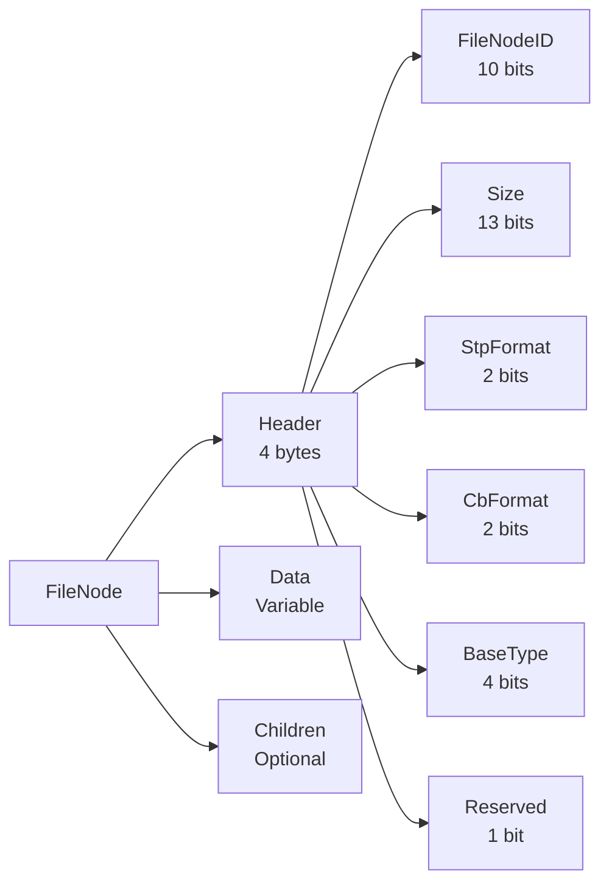
```mermaid
graph LR
    A[FileNode] --> B[Header<br/>4 bytes]
    A --> C[Data<br/>Variable]
    A --> D[Children<br/>Optional]
    
    B --> B1[FileNodeID<br/>10 bits]
    B --> B2[Size<br/>13 bits]
    B --> B3[StpFormat<br/>2 bits]
    B --> B4[CbFormat<br/>2 bits]
    B --> B5[BaseType<br/>4 bits]
    B --> B6[Reserved<br/>1 bit]
```

### FileNode 헤더 비트 레이아웃

```
31                              27 26 25 24 23 22                    10 9                    0
┌───┬───────────────────────────┬──┬──┬──┬──┬───────────────────────┬─────────────────────┐
│ R │        BaseType           │CB│ST│     Size (13 bits)          │   FileNodeID        │
└───┴───────────────────────────┴──┴──┴──┴──┴───────────────────────┴─────────────────────┘
```

- **FileNodeID** (0-9): 노드 타입 식별자
- **Size** (10-22): FileNode 전체 크기
- **StpFormat** (23-24): 파일 포인터 형식
- **CbFormat** (25-26): 데이터 크기 필드 형식
- **BaseType** (27-30): 기본 타입 (0=데이터 없음, 1=데이터 참조, 2=FileNodeList 참조)
- **Reserved** (31): 예약됨 (MUST be 1)

### 주요 FileNode 타입

| FileNodeID | BaseType | 이름 | 허용 포맷 | 설명 |
|------------|----------|------|-----------|------|
| 0x004 | 0 | ObjectSpaceManifestRootFND | one, onetoc2 | 객체 공간 매니페스트 루트 (파일당 1개만 존재) |
| 0x008 | 2 | ObjectSpaceManifestListReferenceFND | one, onetoc2 | 객체 공간 매니페스트 리스트 참조 |
| 0x00C | 0 | ObjectSpaceManifestListStartFND | one, onetoc2 | 객체 공간 매니페스트 리스트 시작 |
| 0x010 | 2 | RevisionManifestListReferenceFND | one, onetoc2 | 리비전 매니페스트 리스트 참조 |
| 0x014 | 0 | RevisionManifestListStartFND | one, onetoc2 | 리비전 매니페스트 리스트 시작 |
| 0x01B | 0 | RevisionManifestStart4FND | onetoc2 | 리비전 매니페스트 시작 (v4) |
| 0x01C | 0 | RevisionManifestEndFND | one, onetoc2 | 리비전 매니페스트 종료 (데이터 없음) |
| 0x01E | 0 | RevisionManifestStart6FND | one | 리비전 매니페스트 시작 (v6) |
| 0x01F | 0 | RevisionManifestStart7FND | one | 리비전 매니페스트 시작 (v7) |
| 0x021 | 0 | GlobalIdTableStartFNDX | onetoc2 | Global ID 테이블 시작 |
| 0x022 | 0 | GlobalIdTableStart2FND | one | Global ID 테이블 시작 (v2, 데이터 없음) |
| 0x024 | 0 | GlobalIdTableEntryFNDX | one, onetoc2 | Global ID 테이블 항목 |
| 0x025 | 0 | GlobalIdTableEntry2FNDX | onetoc2 | Global ID 테이블 항목 (v2) |
| 0x026 | 0 | GlobalIdTableEntry3FNDX | onetoc2 | Global ID 테이블 항목 (v3) |
| 0x028 | 0 | GlobalIdTableEndFNDX | one, onetoc2 | Global ID 테이블 종료 (데이터 없음) |
| 0x02D | 1 | ObjectDeclarationWithRefCountFNDX | onetoc2 | 객체 선언 (참조 카운트, v1) |
| 0x02E | 1 | ObjectDeclarationWithRefCount2FNDX | onetoc2 | 객체 선언 (참조 카운트, v2) |
| 0x041 | 1 | ObjectRevisionWithRefCountFNDX | onetoc2 | 객체 리비전 (참조 카운트, v1) |
| 0x042 | 1 | ObjectRevisionWithRefCount2FNDX | onetoc2 | 객체 리비전 (참조 카운트, v2) |
| 0x059 | 0 | RootObjectReference2FNDX | onetoc2 | 루트 객체 참조 (v2) |
| 0x05A | 0 | RootObjectReference3FND | one | 루트 객체 참조 (v3) |
| 0x05C | 0 | RevisionRoleDeclarationFND | one, onetoc2 | 리비전 역할 선언 |
| 0x05D | 0 | RevisionRoleAndContextDeclarationFND | one | 리비전 역할 및 컨텍스트 선언 |
| 0x072 | 0 | ObjectDeclarationFileData3RefCountFND | one | 파일 데이터 객체 선언 (참조 카운트) |
| 0x073 | 0 | ObjectDeclarationFileData3LargeRefCountFND | one | 파일 데이터 객체 선언 (대형 참조 카운트) |
| 0x07C | 1 | ObjectDataEncryptionKeyV2FNDX | one | 암호화 키 데이터 |
| 0x084 | 1 | ObjectInfoDependencyOverridesFND | one, onetoc2 | 객체 정보 의존성 오버라이드 |
| 0x08C | 0 | DataSignatureGroupDefinitionFND | one, onetoc2 | 데이터 서명 그룹 정의 |
| 0x090 | 2 | FileDataStoreListReferenceFND | one | 파일 데이터 저장소 리스트 참조 |
| 0x094 | 1 | FileDataStoreObjectReferenceFND | one | 파일 데이터 저장소 객체 참조 |
| 0x0A4 | 1 | ObjectDeclaration2RefCountFND | one | 객체 선언 v2 (참조 카운트) |
| 0x0A5 | 1 | ObjectDeclaration2LargeRefCountFND | one | 객체 선언 v2 (대형 참조 카운트) |
| 0x0B0 | 2 | ObjectGroupListReferenceFND | one | 객체 그룹 리스트 참조 |
| 0x0B4 | 0 | ObjectGroupStartFND | one | 객체 그룹 시작 |
| 0x0B8 | 0 | ObjectGroupEndFND | one | 객체 그룹 종료 (데이터 없음) |
| 0x0C2 | 1 | HashedChunkDescriptor2FND | one | 해시된 청크 디스크립터 |
| 0x0C4 | 1 | ReadOnlyObjectDeclaration2RefCountFND | one | 읽기 전용 객체 선언 (참조 카운트) |
| 0x0C5 | 1 | ReadOnlyObjectDeclaration2LargeRefCountFND | one | 읽기 전용 객체 선언 (대형 참조 카운트) |
| 0x0FF | — | ChunkTerminatorFND | one, onetoc2 | 청크 종료 마커 (데이터 없음) |

### FileNodeListFragment 구조

FileNodeList는 하나 이상의 FileNodeListFragment로 분할되어 저장됩니다:

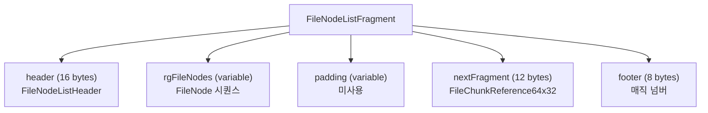
```mermaid
graph TD
    A[FileNodeListFragment] --> B["header (16 bytes)<br/>FileNodeListHeader"]
    A --> C["rgFileNodes (variable)<br/>FileNode 시퀀스"]
    A --> D["padding (variable)<br/>미사용"]
    A --> E["nextFragment (12 bytes)<br/>FileChunkReference64x32"]
    A --> F["footer (8 bytes)<br/>매직 넘버"]
```

#### FileNodeListHeader (16 bytes)

| 필드 | 크기 | 설명 |
|------|------|------|
| uintMagic | 8 | MUST be `0xA4567AB1F5F7F4C4` |
| FileNodeListID | 4 | 파일 노드 리스트 식별자 (≥ 0x10) |
| nFragmentSequence | 4 | 프래그먼트 순서 인덱스 (첫 번째는 0) |

#### FileNodeListFragment Footer

- **footer** (8 bytes): MUST be `0x8BC215C38233BA4B`

#### rgFileNodes 종료 조건

FileNode 시퀀스는 다음 조건 중 하나가 충족되면 종료됩니다:

1. 마지막으로 읽은 FileNode와 nextFragment 사이의 바이트가 4바이트 미만
2. FileNodeID가 0x0FF (ChunkTerminatorFND)인 FileNode 발견
3. 트랜잭션 로그에 지정된 노드 수만큼 읽은 경우

## JCID 타입 시스템

JCID는 객체(Object)의 타입과 객체가 포함하는 데이터의 종류를 식별하는 4바이트 구조입니다.
JCID의 의미는 MS-ONE에서 정의하는 Property Set 또는 File Data Object에 의해 결정됩니다.

### JCID 비트 구조

```
31                              21 20 19 18 17 16 15                              0
┌───────────────────────────────┬──┬──┬──┬──┬──┬─────────────────────────────────┐
│         Reserved (11)         │E │D │C │B │A │           index (16)            │
└───────────────────────────────┴──┴──┴──┴──┴──┴─────────────────────────────────┘
```

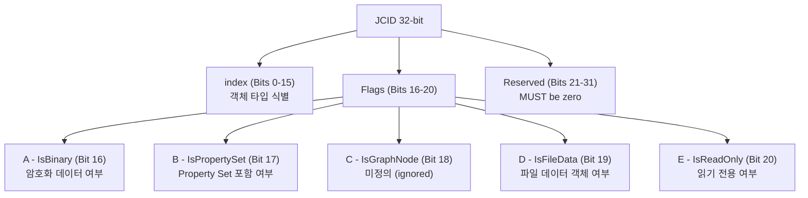
```mermaid
graph TD
    A[JCID 32-bit] --> B["index (Bits 0-15)<br/>객체 타입 식별"]
    A --> C["Flags (Bits 16-20)"]
    A --> D["Reserved (Bits 21-31)<br/>MUST be zero"]
    
    C --> C1["A - IsBinary (Bit 16)<br/>암호화 데이터 여부"]
    C --> C2["B - IsPropertySet (Bit 17)<br/>Property Set 포함 여부"]
    C --> C3["C - IsGraphNode (Bit 18)<br/>미정의 (ignored)"]
    C --> C4["D - IsFileData (Bit 19)<br/>파일 데이터 객체 여부"]
    C --> C5["E - IsReadOnly (Bit 20)<br/>읽기 전용 여부"]
```

- **index** (bits 0-15): 객체 타입을 지정하는 16비트 정수
- **IsBinary** (bit 16): 암호화 데이터 전송 여부
- **IsPropertySet** (bit 17): Property Set 포함 여부
- **IsGraphNode** (bit 18): 미정의, 무시됨
- **IsFileData** (bit 19): 파일 데이터 객체 여부 (true이면 다른 플래그는 모두 false)
- **IsReadOnly** (bit 20): 리비전 시 데이터 변경 불가
- **Reserved** (bits 21-31): MUST be zero

> **참고**: JCID는 객체가 리비전될 때 변경되어서는 안 됩니다 (MUST NOT be changed).

### 주요 JCID 타입

| JCID 값 | 이름 | 설명 |
|---------|------|------|
| 0x00120001 | jcidPersistablePropertyContainerForTOC | TOC 속성 컨테이너 |
| 0x00020001 | jcidPersistablePropertyContainerForTOCSection | TOC 섹션 속성 컨테이너 |
| 0x00060007 | jcidSectionNode | 섹션 노드 |
| 0x00060008 | jcidPageSeriesNode | 페이지 시리즈 노드 |
| 0x0006000B | jcidPageNode | 페이지 노드 |
| 0x0006000C | jcidOutlineNode | 아웃라인 노드 |
| 0x0006000D | jcidOutlineElementNode | 아웃라인 요소 노드 |
| 0x0006000E | jcidRichTextOENode | 리치 텍스트 노드 |
| 0x00060011 | jcidImageNode | 이미지 노드 |
| 0x00060012 | jcidNumberListNode | 번호 목록 노드 |
| 0x00060019 | jcidOutlineGroup | 아웃라인 그룹 |
| 0x00060022 | jcidTableNode | 테이블 노드 |
| 0x00060023 | jcidTableRowNode | 테이블 행 노드 |
| 0x00060024 | jcidTableCellNode | 테이블 셀 노드 |
| 0x0006002C | jcidTitleNode | 제목 노드 |
| 0x00020030 | jcidPageMetaData | 페이지 메타데이터 |
| 0x00020031 | jcidSectionMetaData | 섹션 메타데이터 |
| 0x00060035 | jcidEmbeddedFileNode | 내장 파일 노드 |
| 0x00060037 | jcidPageManifestNode | 페이지 매니페스트 노드 |
| 0x00020038 | jcidConflictPageMetaData | 충돌 페이지 메타데이터 |
| 0x0006003C | jcidVersionHistoryContent | 버전 이력 컨텐츠 |
| 0x0006003D | jcidVersionProxy | 버전 프록시 |
| 0x00120043 | jcidNoteTagSharedDefinitionContainer | 노트 태그 공유 정의 컨테이너 |

## 데이터 참조 메커니즘

### FileChunkReference 타입

OneNote는 여러 타입의 파일 참조를 사용합니다:

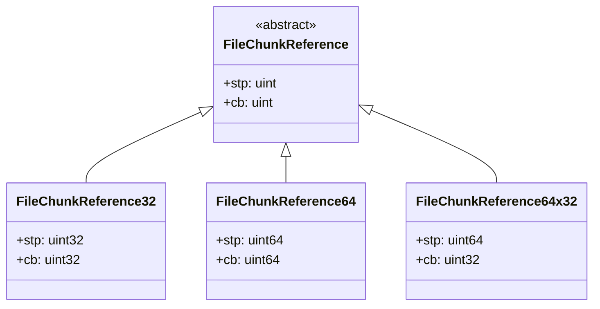
```mermaid
classDiagram
    class FileChunkReference {
        <<abstract>>
        +stp: uint
        +cb: uint
    }
    
    class FileChunkReference32 {
        +stp: uint32
        +cb: uint32
    }
    
    class FileChunkReference64 {
        +stp: uint64
        +cb: uint64
    }
    
    class FileChunkReference64x32 {
        +stp: uint64
        +cb: uint32
    }
    
    FileChunkReference <|-- FileChunkReference32
    FileChunkReference <|-- FileChunkReference64
    FileChunkReference <|-- FileChunkReference64x32
```

### StpFormat과 CbFormat

| Format 값 | StpFormat 의미 | CbFormat 의미 |
|-----------|----------------|---------------|
| 0 | 8 바이트 (비압축) | 4 바이트 |
| 1 | 4 바이트 (비압축) | 8 바이트 |
| 2 | 2 바이트 (압축*8) | 1 바이트 (압축*8) |
| 3 | 4 바이트 (압축*8) | 2 바이트 (압축*8) |

## 속성 시스템

### ObjectSpaceObjectPropSet 구조

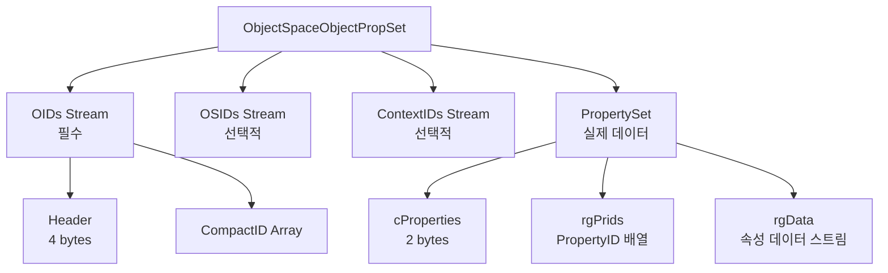
```mermaid
graph TD
    A[ObjectSpaceObjectPropSet] --> B[OIDs Stream<br/>필수]
    A --> C[OSIDs Stream<br/>선택적]
    A --> D[ContextIDs Stream<br/>선택적]
    A --> E[PropertySet<br/>실제 데이터]
    
    B --> B1[Header<br/>4 bytes]
    B --> B2[CompactID Array]
    
    E --> E1[cProperties<br/>2 bytes]
    E --> E2[rgPrids<br/>PropertyID 배열]
    E --> E3[rgData<br/>속성 데이터 스트림]
```

### PropertyID 구조 (4 bytes)

PropertyID는 속성의 식별자와 데이터 타입/크기를 지정합니다:

```
31 30       26 25                                            0
┌──┬─────────┬──────────────────────────────────────────────┐
│bV│  type   │                 id (26 bits)                 │
└──┴─────────┴──────────────────────────────────────────────┘
```

- **id** (bits 0-25): 속성 식별자 (26비트). MS-ONE section 2.1.12에 정의됨
- **type** (bits 26-30): 속성 타입 (5비트). 데이터 크기와 위치를 결정
- **boolValue** (bit 31): Boolean 속성의 값. type이 0x2가 아니면 false

### PropertyType 열거값

| 값 | 이름 | 설명 |
|----|------|------|
| 0x1 | NoData | 데이터 없음 |
| 0x2 | Bool | Boolean 값 (boolValue 필드로 지정) |
| 0x3 | OneByteOfData | rgData에 1바이트 데이터 |
| 0x4 | TwoBytesOfData | rgData에 2바이트 데이터 |
| 0x5 | FourBytesOfData | rgData에 4바이트 데이터 |
| 0x6 | EightBytesOfData | rgData에 8바이트 데이터 |
| 0x7 | FourBytesOfLengthFollowedByData | rgData에 길이(4B) + 가변 데이터 |
| 0x8 | ObjectID | OIDs.body에 CompactID 1개 |
| 0x9 | ArrayOfObjectIDs | OIDs.body에 CompactID 배열 (rgData에 개수 4B) |
| 0xA | ObjectSpaceID | OSIDs.body에 CompactID 1개 |
| 0xB | ArrayOfObjectSpaceIDs | OSIDs.body에 CompactID 배열 (rgData에 개수 4B) |
| 0xC | ContextID | ContextIDs.body에 CompactID 1개 |
| 0xD | ArrayOfContextIDs | ContextIDs.body에 CompactID 배열 (rgData에 개수 4B) |
| 0x10 | ArrayOfPropertyValues | rgData에 속성 값 배열 |
| 0x11 | PropertySet | rgData에 자식 PropertySet 포함 |

### CompactID와 ExtendedGUID

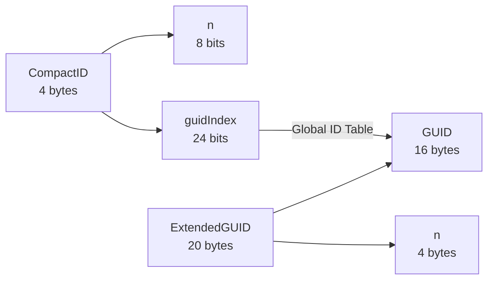
```mermaid
graph LR
    A[CompactID<br/>4 bytes] --> B[n<br/>8 bits]
    A --> C[guidIndex<br/>24 bits]
    
    D[ExtendedGUID<br/>20 bytes] --> E[GUID<br/>16 bytes]
    D --> F[n<br/>4 bytes]
    
    C -->|Global ID Table| E
```

CompactID는 Global Identification Table을 통해 ExtendedGUID로 변환됩니다.

## 내장 파일 처리

### FileDataStoreObject 구조

내장 파일(이미지, 첨부파일 등)은 FileDataStoreObject로 저장됩니다:

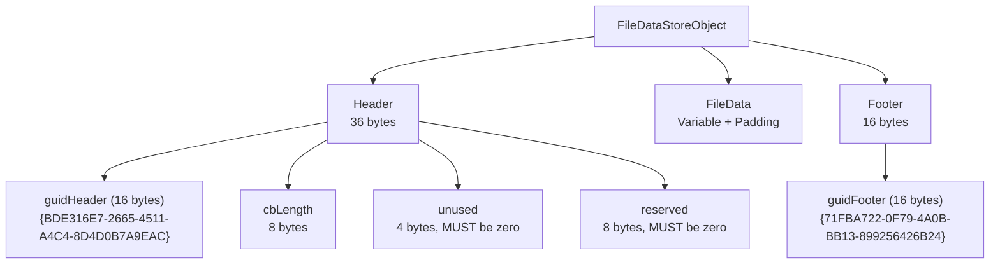
```mermaid
graph TD
    A[FileDataStoreObject] --> B[Header<br/>36 bytes]
    A --> C[FileData<br/>Variable + Padding]
    A --> D[Footer<br/>16 bytes]
    
    B --> B1["guidHeader (16 bytes)<br/>{BDE316E7-2665-4511-A4C4-8D4D0B7A9EAC}"]
    B --> B2[cbLength<br/>8 bytes]
    B --> B3[unused<br/>4 bytes, MUST be zero]
    B --> B4[reserved<br/>8 bytes, MUST be zero]
    
    D --> D1["guidFooter (16 bytes)<br/>{71FBA722-0F79-4A0B-BB13-899256426B24}"]
```

| 필드 | 크기 | 설명 |
|------|------|------|
| guidHeader | 16 | MUST be `{BDE316E7-2665-4511-A4C4-8D4D0B7A9EAC}` |
| cbLength | 8 | FileData의 패딩 제외 실제 크기 (bytes) |
| unused | 4 | MUST be zero, ignored |
| reserved | 8 | MUST be zero, ignored |
| FileData | variable | 파일 데이터 (8바이트 경계 정렬을 위한 패딩 포함) |
| guidFooter | 16 | MUST be `{71FBA722-0F79-4A0B-BB13-899256426B24}` |

> **참고**: FileData 끝에 패딩이 추가되어 FileDataStoreObject 구조가 8바이트 경계에서 끝나도록 합니다.

### 내장 파일 처리 플로우

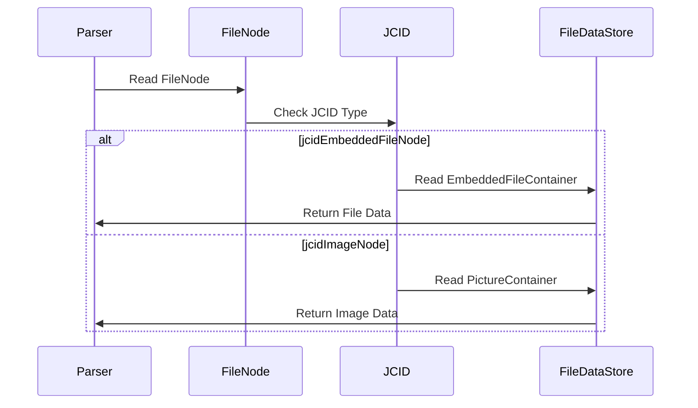
```mermaid
sequenceDiagram
    participant Parser
    participant FileNode
    participant JCID
    participant FileDataStore
    
    Parser->>FileNode: Read FileNode
    FileNode->>JCID: Check JCID Type
    alt jcidEmbeddedFileNode
        JCID->>FileDataStore: Read EmbeddedFileContainer
        FileDataStore->>Parser: Return File Data
    else jcidImageNode
        JCID->>FileDataStore: Read PictureContainer
        FileDataStore->>Parser: Return Image Data
    end
```

## 객체 공간 계층 구조

OneNote 파일은 객체 공간(Object Space)을 통해 데이터를 계층적으로 구성합니다.

### 객체 공간 개념

**Object Space**는 관련 객체들의 논리적 그룹입니다. 각 객체 공간은 ExtendedGUID로 식별되며,
하나 이상의 리비전(Revision)을 가집니다.

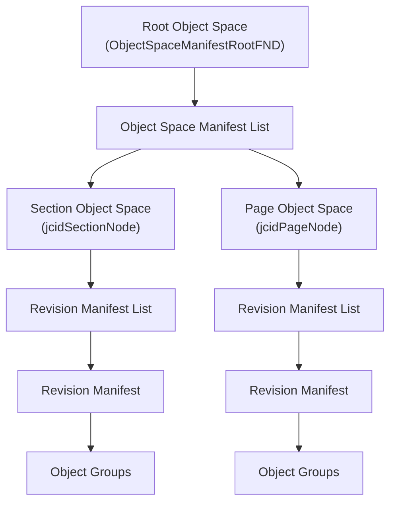
```mermaid
graph TD
    A["Root Object Space<br/>(ObjectSpaceManifestRootFND)"] --> B["Object Space Manifest List"]
    B --> C1["Section Object Space<br/>(jcidSectionNode)"]
    B --> C2["Page Object Space<br/>(jcidPageNode)"]
    
    C1 --> D1["Revision Manifest List"]
    C2 --> D2["Revision Manifest List"]
    
    D1 --> E1["Revision Manifest"]
    D2 --> E2["Revision Manifest"]
    
    E1 --> F1["Object Groups"]
    E2 --> F2["Object Groups"]
```

### 논리적 컨텐츠 계층

MS-ONE 사양에서 정의하는 OneNote 컨텐츠의 논리적 구조:

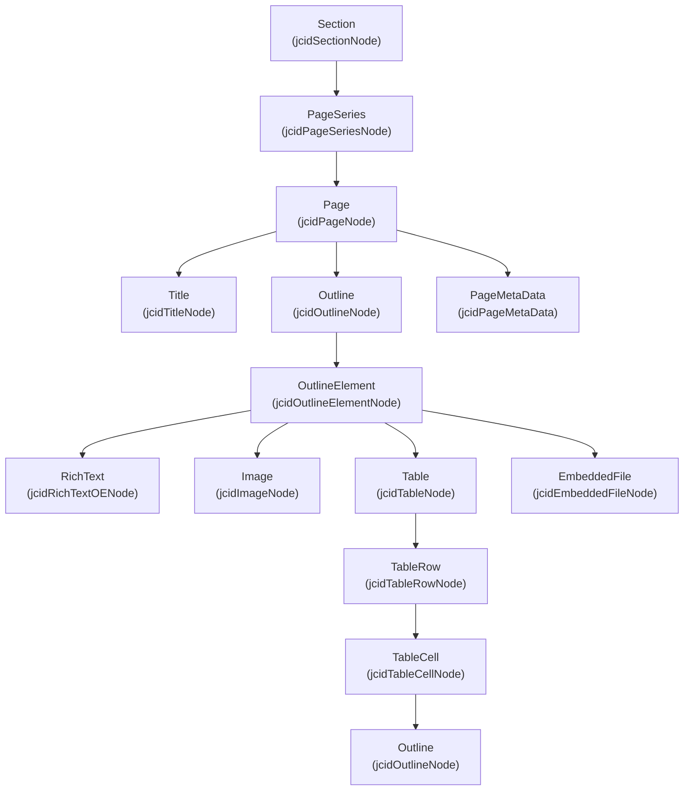
```mermaid
graph TD
    S["Section<br/>(jcidSectionNode)"] --> PS["PageSeries<br/>(jcidPageSeriesNode)"]
    PS --> P["Page<br/>(jcidPageNode)"]
    
    P --> T["Title<br/>(jcidTitleNode)"]
    P --> O["Outline<br/>(jcidOutlineNode)"]
    P --> PM["PageMetaData<br/>(jcidPageMetaData)"]
    
    O --> OE["OutlineElement<br/>(jcidOutlineElementNode)"]
    
    OE --> RT["RichText<br/>(jcidRichTextOENode)"]
    OE --> IMG["Image<br/>(jcidImageNode)"]
    OE --> TBL["Table<br/>(jcidTableNode)"]
    OE --> EF["EmbeddedFile<br/>(jcidEmbeddedFileNode)"]
    
    TBL --> TR["TableRow<br/>(jcidTableRowNode)"]
    TR --> TC["TableCell<br/>(jcidTableCellNode)"]
    TC --> O2["Outline<br/>(jcidOutlineNode)"]
```

### SectionObjectSpace

- **기본 컨텐츠 루트 객체**: jcidSectionNode 구조
- **메타데이터 루트 객체**: jcidSectionMetaData 구조
- 자식으로 PageSeries → Page 순서로 탐색

### PageObjectSpace

- **기본 컨텐츠 루트 객체**: jcidPageManifestNode 구조
- **메타데이터 루트 객체**: jcidPageMetaData 구조
- 페이지 내에 Title, Outline 등의 컨텐츠 포함

## 리비전 시스템

OneNote는 리비전 시스템을 통해 객체의 변경 이력을 관리합니다.

### Revision Manifest

리비전 매니페스트는 특정 시점의 객체 공간 상태를 정의합니다:

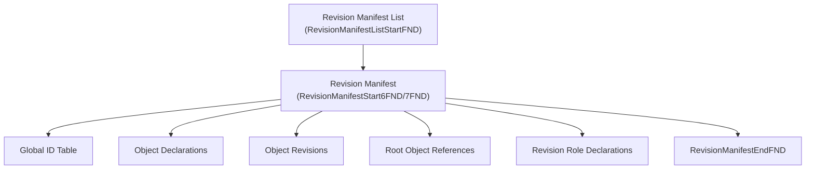
```mermaid
graph TD
    A["Revision Manifest List<br/>(RevisionManifestListStartFND)"] --> B["Revision Manifest<br/>(RevisionManifestStart6FND/7FND)"]
    B --> C["Global ID Table"]
    B --> D["Object Declarations"]
    B --> E["Object Revisions"]
    B --> F["Root Object References"]
    B --> G["Revision Role Declarations"]
    B --> H["RevisionManifestEndFND"]
```

### 리비전 매니페스트 구성 요소

| 요소 | 설명 |
|------|------|
| **rid** | 리비전의 ExtendedGUID 식별자 |
| **ridDependent** | 이 리비전이 의존하는 기본 리비전 |
| **Global ID Table** | CompactID → ExtendedGUID 매핑 테이블 |
| **Object Declarations** | 새로 생성되거나 변경된 객체 선언 |
| **Root Object References** | 루트 객체에 대한 참조 |

### Revision Role

리비전 역할은 객체 공간의 현재 리비전을 결정합니다:

| 역할 값 | 의미 |
|---------|------|
| 1 | 기본 컨텐츠 (Default content) |
| 2 | 메타데이터 (Metadata) |
| 기타 | 추가적인 역할 정의 가능 |

## 트랜잭션 로그

파일 무결성을 보장하기 위해 모든 쓰기 작업은 트랜잭션으로 구조화됩니다.

### 트랜잭션 구성

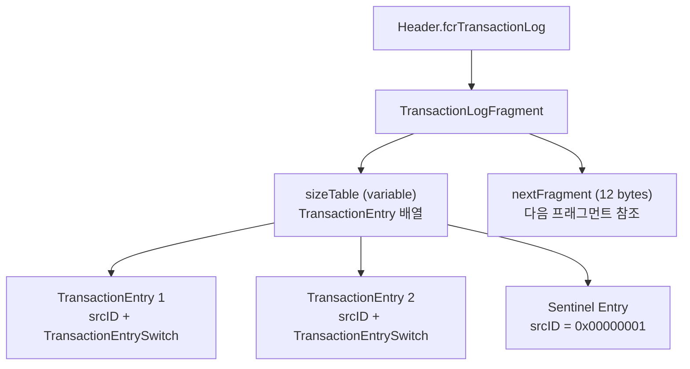
```mermaid
graph TD
    A["Header.fcrTransactionLog"] --> B["TransactionLogFragment"]
    B --> C["sizeTable (variable)<br/>TransactionEntry 배열"]
    B --> D["nextFragment (12 bytes)<br/>다음 프래그먼트 참조"]
    
    C --> E["TransactionEntry 1<br/>srcID + TransactionEntrySwitch"]
    C --> F["TransactionEntry 2<br/>srcID + TransactionEntrySwitch"]
    C --> G["Sentinel Entry<br/>srcID = 0x00000001"]
```

### TransactionEntry 구조 (8 bytes)

| 필드 | 크기 | 설명 |
|------|------|------|
| srcID | 4 | 수정된 FileNodeList의 ID (0x00000001이면 센티널) |
| TransactionEntrySwitch | 4 | srcID가 센티널이면 CRC, 아니면 FileNode 수 |

### 트랜잭션 커밋 규칙

1. 트랜잭션의 모든 TransactionEntry는 순차적으로 추가됨
2. 각 트랜잭션은 센티널 항목(srcID = 0x00000001)으로 종료
3. Header.cTransactionsInLog가 갱신되어야 트랜잭션이 커밋됨
4. 더 높은 번호의 미커밋 트랜잭션과 관련 FileNode는 무시됨
5. FileNode 구조는 기존 리스트에서 수정/제거 불가, 추가만 가능

## Global Identification Table

Global Identification Table은 CompactID를 ExtendedGUID로 변환하는 매핑 테이블입니다.

### 구조

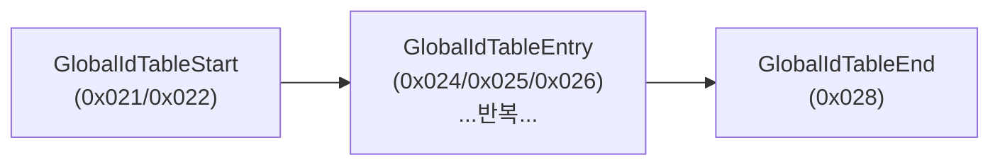
```mermaid
graph LR
    A["GlobalIdTableStart<br/>(0x021/0x022)"] --> B["GlobalIdTableEntry<br/>(0x024/0x025/0x026)<br/>...반복..."]
    B --> C["GlobalIdTableEnd<br/>(0x028)"]
```

### GlobalIdTableEntryFNDX

각 항목은 인덱스와 GUID를 매핑합니다:

| 필드 | 크기 | 설명 |
|------|------|------|
| index | 4 | CompactID.guidIndex 값과 매칭되는 인덱스 |
| guid | 16 | ExtendedGUID.guid 부분 |

### CompactID → ExtendedGUID 변환

```
CompactID { n=5, guidIndex=3 }
    ↓ Global ID Table[guidIndex=3] → guid = {AAAA...}
ExtendedGUID { guid={AAAA...}, n=5 }
```

- CompactID의 **guidIndex** (24비트)로 Global ID Table에서 GUID를 조회
- CompactID의 **n** (8비트)은 ExtendedGUID의 n 값으로 직접 사용
- 테이블은 리비전 매니페스트 내에서 정의되며, 해당 리비전의 객체에만 적용

## 파일 파싱 순서

1. **헤더 검증**: 첫 16바이트(guidFileType)로 파일 타입(.one/.onetoc2) 확인
2. **헤더 파싱**: 1024바이트 헤더 읽기, guidFileFormat 검증(`{109ADD3F-911B-49F5-A5D0-1791EDC8AED8}`)
3. **트랜잭션 로그 읽기**: fcrTransactionLog에서 유효한 트랜잭션 수(cTransactionsInLog) 확인
4. **루트 FileNodeList 탐색**: fcrFileNodeListRoot부터 시작
5. **Object Space Manifest 탐색**: ObjectSpaceManifestRootFND에서 루트 객체 공간 식별
6. **Revision Manifest 탐색**: 각 객체 공간의 리비전 매니페스트 리스트 탐색
7. **Global ID Table 구축**: 리비전 내의 CompactID → ExtendedGUID 매핑 구축
8. **객체 파싱**: 객체 선언/리비전 노드에서 PropertySet 추출
9. **속성 추출**: PropertySet에서 메타데이터와 컨텐츠 추출
10. **내장 파일 추출**: FileDataStoreListReferenceFND → FileDataStoreObject에서 파일 데이터 추출

## 코드 예제

### 파일 시그니처 확인

```python
def check_valid(file):
    """OneNote 파일 시그니처 확인"""
    signature = file.read(16)
    
    ONE_SIGNATURE = b"\xE4\x52\x5C\x7B\x8C\xD8\xA7\x4D\xAE\xB1\x53\x78\xD0\x29\x96\xD3"
    ONETOC2_SIGNATURE = b"\xA1\x2F\xFF\x43\xD9\xEF\x76\x4C\x9E\xE2\x10\xEA\x57\x22\x76\x5F"
    
    return signature in (ONE_SIGNATURE, ONETOC2_SIGNATURE)
```

### FileNode 헤더 파싱

```python
def parse_filenode_header(header_bytes):
    """FileNode 헤더 파싱"""
    header = struct.unpack('<I', header_bytes)[0]
    
    file_node_id = header & 0x3ff           # Bits 0-9
    size = (header >> 10) & 0x1fff         # Bits 10-22
    stp_format = (header >> 23) & 0x3      # Bits 23-24
    cb_format = (header >> 25) & 0x3       # Bits 25-26
    base_type = (header >> 27) & 0xf       # Bits 27-30
    
    return {
        'id': file_node_id,
        'size': size,
        'stp_format': stp_format,
        'cb_format': cb_format,
        'base_type': base_type
    }
```

## 참고 자료

- [MS-ONE] - OneNote File Format Specification
- [MS-ONESTORE] - OneNote Revision Store File Format Specification
- [MS-DTYP] - Windows Data Types
- [MS-OSHARED] - Office Common Data Types and Objects Structures

## 용어 정리

| 용어 | 설명 |
|------|------|
| **GUID** | Globally Unique Identifier, 128비트 고유 식별자 |
| **ExtendedGUID** | GUID(16 bytes) + n(4 bytes)으로 구성된 20바이트 확장 식별자 |
| **CompactID** | n(8 bits) + guidIndex(24 bits)로 구성된 4바이트 압축 식별자. Global ID Table을 통해 ExtendedGUID로 변환 |
| **JCID** | 객체의 타입과 데이터 종류를 식별하는 4바이트 구조 (index + 플래그) |
| **FileNode** | OneNote 파일의 기본 데이터 단위. 헤더(4 bytes)와 가변 데이터로 구성 |
| **FileNodeList** | FileNode의 논리적 시퀀스. 하나 이상의 FileNodeListFragment로 저장 |
| **FileNodeListFragment** | FileNodeList의 물리적 저장 단위. header + FileNodes + nextFragment + footer로 구성 |
| **PropertySet** | 객체의 속성을 정의하는 데이터 집합. cProperties + rgPrids + rgData로 구성 |
| **PropertyID** | 속성의 식별자(26비트)와 타입(5비트)을 지정하는 4바이트 구조 |
| **FileChunkReference** | 파일 내 데이터 위치(stp)와 크기(cb)를 지정하는 참조 구조 |
| **Object Space** | 관련 객체들의 논리적 그룹. ExtendedGUID로 식별 |
| **Revision** | 객체 공간의 특정 시점 상태. 리비전 매니페스트로 정의 |
| **Revision Manifest** | 리비전에 포함된 객체 선언, ID 테이블, 루트 참조 등의 집합 |
| **Transaction Log** | 파일 쓰기의 무결성을 보장하는 트랜잭션 기록. TransactionEntry의 시퀀스 |
| **FileDataStoreObject** | 내장 파일(이미지, 첨부 등)의 바이너리 데이터를 저장하는 구조 |
| **fcrZero** | stp=0, cb=0인 FileChunkReference (참조 없음) |
| **fcrNil** | 모든 비트가 1인 FileChunkReference (참조 없음/유효하지 않음) |

---

*이 문서는 pyOneNote 프로젝트의 일부로, MS-ONE(v3.4)과 MS-ONESTORE(v13.3) 사양을 기반으로 작성되었습니다.*
